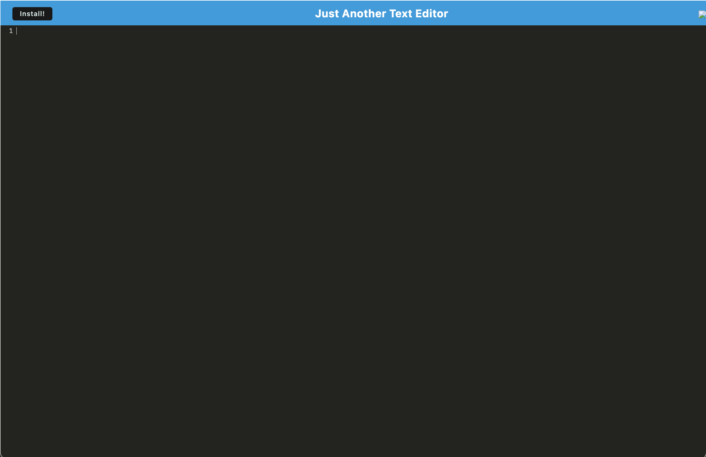

# J.A.T.E.
This is Just A Simple Text Editor (J.A.T.E.)
 
## Table of Contents
* [Installation](#installation)
* [Usage](#usage)
* [License](#license)
* [Contributing](#contributing)
* [Tests](#tests)
* [Questions](#questions)
 
## Installation
To install the required dependencies, run ```npm install```. To create the distributable directory, run ```npm run build```.
 
## Usage
To start the application, run ``npm run start:dev``` and navigate to ```http://localhost:3000``` and use the text editor.



To download the text editor toy our local machine, click the "install" button in the top left hand corner of the screen.


 
## License
[](https://opensource.org/licenses/MIT)

MIT License

Copyright (c) 2024 Ethan Robert Owens

Permission is hereby granted, free of charge, to any person obtaining a copy
of this software and associated documentation files (the "Software"), to deal
in the Software without restriction, including without limitation the rights
to use, copy, modify, merge, publish, distribute, sublicense, and/or sell
copies of the Software, and to permit persons to whom the Software is
furnished to do so, subject to the following conditions:

The above copyright notice and this permission notice shall be included in all
copies or substantial portions of the Software.

THE SOFTWARE IS PROVIDED "AS IS", WITHOUT WARRANTY OF ANY KIND, EXPRESS OR
IMPLIED, INCLUDING BUT NOT LIMITED TO THE WARRANTIES OF MERCHANTABILITY,
FITNESS FOR A PARTICULAR PURPOSE AND NONINFRINGEMENT. IN NO EVENT SHALL THE
AUTHORS OR COPYRIGHT HOLDERS BE LIABLE FOR ANY CLAIM, DAMAGES OR OTHER
LIABILITY, WHETHER IN AN ACTION OF CONTRACT, TORT OR OTHERWISE, ARISING FROM,
OUT OF OR IN CONNECTION WITH THE SOFTWARE OR THE USE OR OTHER DEALINGS IN THE
SOFTWARE.
 
## Contributing
Send any code snippits or suggestions to me via email or through a message on GitHub (both are below).
 
## Tests
No tests available.
 
## Questions
* GitHub: [@Teacher2Coder](https://www.github.com/Teacher2Coder)
* Email: ethan.owens4@gmail.com